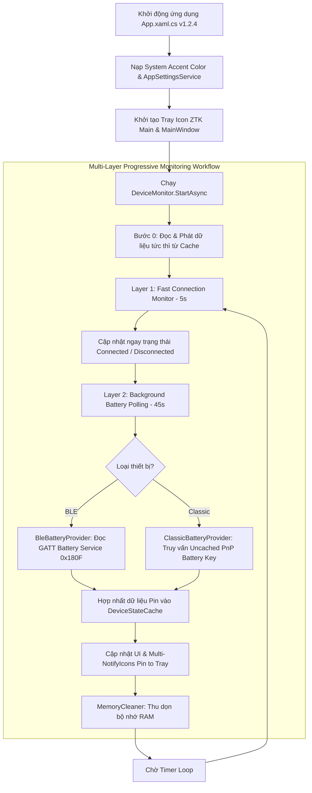

# Tổng Quan Dự Án Wireless Battery Level (WBL)

## 1. Giới Thiệu Dự Án
**Wireless Battery Level (WBL)** là ứng dụng desktop Windows gọn nhẹ, hiện đại được viết bằng C# .NET 8 và WPF, giúp người dùng dễ dàng theo dõi phần trăm pin của các thiết bị không dây kết nối qua Bluetooth (Classic Bluetooth và Bluetooth Low Energy - BLE) ngay trên thanh Taskbar / System Tray.

### Phiên bản hiện tại: **v1.2.4**

### Kiến Trúc Dự Án (Clean Architecture 3 Lớp)
* **WirelessBatteryLevel.Core**: Chứa các interface cơ bản (`IDeviceDiscovery`, `IBatteryProvider`, `IDeviceManager`) và các Data Model (`WirelessDevice`, `BatteryInfo`, `DeviceStatus`, `DeviceSource`).
* **WirelessBatteryLevel.Infrastructure**: Xử lý việc giao tiếp với phần cứng Windows (quét thiết bị Bluetooth LE / Classic, đọc dữ liệu GATT BLE, truy vấn Windows PnP Properties cho Classic Bluetooth, quản lý bộ nhớ đệm `DeviceStateCache` và tiến trình giám sát `DeviceMonitor`).
* **WirelessBatteryLevel.App**: Tầng giao diện WPF, quản lý System Tray Icon, Cửa sổ hiển thị Flyout Popup (`MainWindow`), ViewModels (`TrayViewModel`, `DeviceItemViewModel`), Custom Controls (`BatteryIcon`, `SegmentedBarIcon`, `CircularRingIcon`) và cài đặt ứng dụng (`AppSettingsService`).

---

## 2. Chức Năng Chính & Mô Tả Chi Tiết Luồng Hoạt Động

### 2.1 Quét & Định Danh Thiết Bị (Device Discovery & Aggregation)
* **ClassicBluetoothDiscovery**: Quét danh sách thiết bị Bluetooth cổ điển đã kết nối / ghép đôi với máy tính qua API WinRT `Windows.Devices.Bluetooth.BluetoothDevice`.
* **BluetoothLEDiscovery**: Quét danh sách thiết bị Bluetooth Low Energy (BLE) qua API WinRT `Windows.Devices.Bluetooth.BluetoothLEDevice`.
* **DeviceAggregator**: Hợp nhất kết quả từ 2 nguồn quét trên. Tránh việc thiết bị bị trùng lặp bằng cách so khớp theo địa chỉ MAC (`Address`) hoặc `DeviceId`, đồng thời gộp thông tin tên thiết bị và trạng thái kết nối (`IsConnected`).

### 2.2 Trích Xuất Dung Lượng Pin (Battery Level Resolution)
* **BleBatteryProvider**: Với thiết bị Bluetooth LE, ứng dụng kết nối trực tiếp đến GATT Server của thiết bị, tìm kiếm **Battery Service** (UUID `0000180F-0000-1000-8000-00805F9B34FB`) và đọc giá trị byte từ **Battery Level Characteristic** (UUID `00002A19-0000-1000-8000-00805F9B34FB`).
* **ClassicBatteryProvider**: Với thiết bị Classic Bluetooth, ứng dụng truy vấn thuộc tính PnP Uncached mới nhất của Windows (`DEVPKEY_Device_BatteryLevel`: `{104EA319-6EE2-4701-BD47-8DDBF425BBE5} 2`) qua 3 cấp độ nút hệ thống (Association Endpoint, Device Container, System Device Node).

### 2.3 Giám Sát Bất Đồng Bộ 2 Lớp Độc Lập (Multi-Layer Monitoring System)
1. **Layer 1 (Fast Connection Monitor - 100ms)**: Hàm kiểm tra trạng thái kết nối chạy độc lập với tần suất 100ms. Ngay khi một thiết bị Bluetooth ngắt hoặc kết nối lại, hệ thống sẽ phát hiện và cập nhật trạng thái hiển thị lập tức.
2. **Layer 2 (Background Battery Polling - 45s)**: Tiến trình trích xuất dung lượng pin chạy ngầm bất đồng bộ. Dữ liệu pin sau khi đọc xong được hợp nhất an toàn vào `DeviceStateCache` mà không làm reset hay đè `null` dữ liệu hiện tại khi refresh.
3. **Multi-Icon Pin to Tray System**: Kiến trúc khay hệ thống hỗ trợ ghim từng thiết bị lên Tray Icon riêng biệt (Multi-NotifyIcon) hiển thị icon pin Classic Monochrome thon dài 32x32px sắc nét không bị nén.
4. **Tự động tối ưu bộ nhớ**: Sau mỗi lần cập nhật hoặc ẩn cửa sổ, `MemoryCleaner.TrimWorkingSet()` được gọi để thu gom bộ nhớ và duy trì mức chiếm dụng RAM cực thấp (~10-15MB).

---

## 3. Các Chức Năng Liên Quan Đến UI

### 3.1 Cửa Sổ Popup Flyout & System Tray (Tray Window & Popups)

#### A. Cửa sổ Flyout Popup chính (`MainWindow`)
* **Thiết kế chuẩn Windows 10 Native**: Cửa sổ không viền (`WindowStyle="None"`), trong suốt (`AllowsTransparency="True"`), luôn nằm trên cùng (`Topmost="True"`), góc vuông sắc nét (`CornerRadius="0"`), tông màu tối Dark Theme (`#1F1F1F`).
* **Vị trí hiển thị tự động (`PositionNearTray`)**: Tự động tính toán vị trí góc dưới bên phải màn hình, nằm khít trên thanh Taskbar Windows (`SystemParameters.WorkArea`).
* **Tương tác với System Tray Icon (`NotifyIcon`)**:
  * **Click chuột trái**: Bật/Tắt (Toggle) ẩn hiện cửa sổ Flyout Popup.
  * **Click chuột phải**: Mở Menu Cài Đặt (WPF ContextMenu) theo vị trí con trỏ chuột. Tooltip mặc định hiển thị `"Wireless Battery Level (ZTK)"`.

#### B. Chức Năng "Pin to Tray" (Multi-Icon Architecture - Optional)
* **Chế độ Mặc định**: OFF (`IsPinToTrayEnabled = false`).
* **Main Tray Icon**: Giữ nguyên Logo ZTK quen thuộc của ứng dụng.
* **Khi Bật (ON)**: Ứng dụng tạo riêng từng `NotifyIcon` cho từng thiết bị connected. Mỗi thiết bị sở hữu 1 Icon pin Classic Monochrome dài & cao 32x32px nét 100% chuẩn pixel-perfect (`SmoothingMode.None`), căn giữa đối xứng 7px top/bottom.

#### C. Menu Ngữ Cảnh (Win10 Context Menu & Auto-Close Timer 10s)
* **Layout Cố Định Cột Icon (Fixed 22px Icon/Checkmark Column)**: Cột icon/checkmark quy định cố định 22px cho TẤT CẢ các mục menu, đảm bảo toàn bộ dòng chữ tiêu đề (Header Text) nằm thẳng hàng 100% từ trên xuống dưới, không bị lệch hay shift dòng.
* **Thanh Phân Cách Separator**: Thiết kế tràn chiều rộng menu với khoảng lùi 6px tinh tế ở 2 đầu (`Margin="6,4,6,4"`).
* **Menu Cài Đặt (Header / Tray Right-Click)**:
  * **Pin Devices to System Tray**: Bật/Tắt chế độ ghim thiết bị ra Tray Icon.
  * **Window Auto-Close Time**: Tùy chỉnh thời gian tự đóng Flyout Popup (15s, 30s, 45s, 1m, 2m).
  * **Auto-Refresh Interval**: Tùy chỉnh chu kỳ tự động quét lại thiết bị (15s, 30s, 45s, 1m, 2m).
  * **Battery Color Display Mode**: Chọn chế độ hiển thị màu sắc pin (Monochrome Mode / Color Mode).
  * **Exit**: Thoát ứng dụng hoàn toàn.
* **Menu Ngữ Cảnh Từng Thiết Bị (Right-Click vào Device Card)**:
  * Chuyển đổi kiểu dáng hiển thị pin riêng biệt cho thiết bị (*Classic Battery*, *Linear Capsule Bar*, *Circular Ring Gauge*).
* **Tính năng Auto-Close**: Tự động đóng menu sau 10 giây nếu người dùng không thao tác (`menuAutoCloseTimer = 10s`).

#### D. Giao Diện Header & Footer
* **Header**:
  * Icon Bluetooth chuẩn Windows 10 (đổi sang System Accent khi rê chuột).
  * Tiêu đề ứng dụng "Wireless Battery" & Tác giả "Made by Ztk".
  * Nút Refresh & Nút Settings với hiệu ứng hover nền `#2D2D30` và đổi màu icon sang System Accent Color.
  * Tự động kích hoạt refresh nhanh tức thì khi nhấn Refresh hoặc mở cửa sổ/menu.
* **Footer**:
  * Hiển thị thời gian cập nhật gần nhất ("Updated at: HH:mm:ss").
  * Hiển thị phiên bản ứng dụng ("v1.2.4").

---

## 3.2 Hiển Thị Dung Lượng Pin (Battery Display Systems)

#### A. Chế Độ Màu Sắc Pin (`BatteryColorMode`)
1. **Monochrome Mode (`DefaultWhite`)**: Icon pin màu trắng tối giản chuẩn phong cách Windows 10.
2. **Color Mode (`DynamicColors`)**: Màu điền thay đổi động theo dung lượng pin (>50% Xanh Lá `#10B981`, 20-50% Vàng `#F59E0B`, <20% Đỏ `#EF4444`).

#### B. 3 Kiểu Dáng Hiển Thị Pin (Battery Display Styles)
* **1. Classic Battery**: Viên pin nằm ngang cổ điển có cực pin bên phải.
* **2. Linear Capsule Bar**: Giao diện LED phân đoạn 5 Segment full-width.
* **3. Circular Ring Gauge**: Vòng tròn đồng trục (57x57px) hiện đại hỗ trợ 2 Sub-Mode (*Progress Arc* & *Rise Up*).
