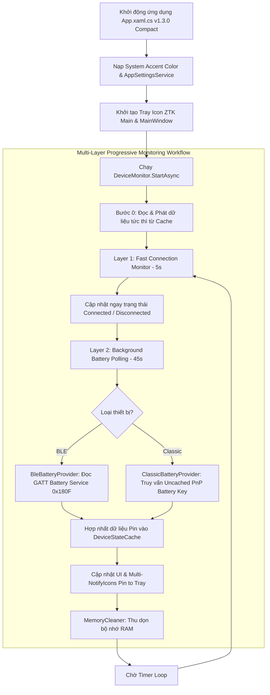

# Tổng Quan Dự Án Wireless Battery Level (WBL)

## 1. Giới Thiệu Dự Án
**Wireless Battery Level (WBL)** là ứng dụng desktop Windows gọn nhẹ, hiện đại được viết bằng C# .NET 8 và WPF, giúp người dùng dễ dàng theo dõi phần trăm pin của các thiết bị không dây kết nối qua Bluetooth (Classic Bluetooth và Bluetooth Low Energy - BLE) ngay trên thanh Taskbar / System Tray.

### Phiên bản hiện tại: **v1.3.0 (Compact Version)**

### Kiến Trúc Dự Án (Clean Architecture 3 Lớp)
* **WirelessBatteryLevel.Core**: Chứa các interface cơ bản (`IDeviceDiscovery`, `IBatteryProvider`, `IDeviceManager`) và các Data Model (`WirelessDevice`, `BatteryInfo`, `DeviceStatus`, `DeviceSource`).
* **WirelessBatteryLevel.Infrastructure**: Xử lý việc giao tiếp với phần cứng Windows (quét thiết bị Bluetooth LE / Classic, đọc dữ liệu GATT BLE, truy vấn Windows PnP Properties cho Classic Bluetooth, quản lý bộ nhớ đệm `DeviceStateCache` và tiến trình giám sát `DeviceMonitor`).
* **WirelessBatteryLevel.App**: Tầng giao diện WPF, quản lý System Tray Icon, Cửa sổ hiển thị Flyout Popup tinh gọn (`MainWindow`), ViewModels (`TrayViewModel`, `DeviceItemViewModel`), Custom Controls (`BatteryIcon`) và cài đặt ứng dụng (`AppSettingsService`).

---

## 2. Chức Năng Chính & Mô Tả Chi Tiết Luồng Hoạt Động

### 2.1 Quét & Định Danh Thiết Bị (Device Discovery & Aggregation)
* **ClassicBluetoothDiscovery**: Quét danh sách thiết bị Bluetooth cổ điển đã kết nối / ghép đôi với máy tính qua API WinRT `Windows.Devices.Bluetooth.BluetoothDevice`.
* **BluetoothLEDiscovery**: Quét danh sách thiết bị Bluetooth Low Energy (BLE) qua API WinRT `Windows.Devices.Bluetooth.BluetoothLEDevice`.
* **DeviceAggregator**: Hợp nhất kết quả từ 2 nguồn quét trên. Tránh việc thiết bị bị trùng lặp bằng cách so khớp theo địa chỉ MAC (`Address`) hoặc `DeviceId`, đồng thời gộp thông tin tên thiết bị và trạng thái kết nối (`IsConnected`).

### 2.2 Trích Xuất Dung Lượng Pin (Battery Level Resolution)
* **BleBatteryProvider**: Với thiết bị Bluetooth LE, ứng dụng kết nối trực tiếp đến GATT Server của thiết bị, tìm kiếm **Battery Service** (UUID `0000180F-0000-1000-8000-00805F9B34FB`) và đọc giá trị byte từ **Battery Level Characteristic** (UUID `00002A19-0000-1000-8000-00805F9B34FB`).
* **ClassicBatteryProvider**: Với thiết bị Classic Bluetooth, ứng dụng truy vấn thuộc tính PnP Uncached mới nhất của Windows (`DEVPKEY_Device_BatteryLevel`: `{104EA319-6EE2-4701-BD47-8DDBF425BBE5} 2`) qua 3 cấp độ nút hệ thống (Association Endpoint, Device Container, System Device Node).

### 2.3 Giám Sát Bất Đồng Bộ 2 Lớp Độc Lập (Multi-Layer Monitoring System)
1. **Layer 1 (Fast Connection Monitor - 100ms)**: Hàm kiểm tra trạng thái kết nối chạy độc lập với tần suất 100ms. Ngay khi một thiết bị Bluetooth ngắt hoặc kết nối lại, hệ thống sẽ phát hiện và cập nhật trạng thái hiển thị lập tức.
2. **Layer 2 (Background Battery Polling - 45s)**: Tiến trình trích xuất dung lượng pin chạy ngầm bất đồng bộ. Dữ liệu pin sau khi đọc xong được hợp nhất an toàn vào `DeviceStateCache` mà không làm reset hay đè `null` dữ liệu hiện tại khi refresh.
3. **Multi-Icon Pin to Tray System**: Kiến trúc khay hệ thống hỗ trợ ghim từng thiết bị lên Tray Icon riêng biệt (Multi-NotifyIcon) hiển thị icon pin Classic Monochrome thon dài 32x32px sắc nét không bị nén.
4. **Tự động tối ưu bộ nhớ**: Sau mỗi lần cập nhật hoặc ẩn cửa sổ, `MemoryCleaner.TrimWorkingSet()` được gọi để thu gom bộ nhớ và duy trì mức chiếm dụng RAM cực thấp (~10-15MB).

---

## 3. Các Đặc Điểm Phiên Bản Compact (Compact Version Features)

### 3.1 Giao Diện & Kích Thước Tinh Gọn (Compact UI)
* **Kích thước cửa sổ Flyout (`280x310px`)**: Thu nhỏ chiều rộng và chiều cao tổng thể của cửa sổ chính, giúp thẻ card thiết bị hiển thị thon gọn và vừa vặn ở góc màn hình.
* **Giữ nguyên font chữ & tỉ lệ gốc**: Cỡ chữ và biểu tượng icon được giữ nguyên tỉ lệ sắc nét chuẩn Windows 10 Native.
* **Loại bỏ hiệu ứng Hover thừa**: Giữ phong cách tĩnh phẳng tối giản cho các nhãn tĩnh (Bluetooth Icon, Title, Author, Timestamp, Version, Device Name & Battery Percentage).

### 3.2 Hệ Thống Hiển Thị Pin & Context Menu
1. **Dạng viên pin Classic duy nhất**: Tinh giản loại bỏ các kiểu hiển thị phụ (Linear Capsule Bar & Circular Ring Gauge) để ứng dụng siêu gọn nhẹ.
2. **Default Mode (Màu sắc mặc định)**: Mặc định hiển thị viên pin và indicator màu trắng khi kết nối.
3. **Tích hợp ColorMode vào Left Side Indicator**:
   - **Default Mode**: Dải chỉ báo cạnh trái màu trắng khi Connected, màu xám khi Disconnected.
   - **Color Mode**: Dải chỉ báo cạnh trái phản ánh màu sắc dung lượng pin (Xanh `>50%`, Vàng `20-50%`, Đỏ `<20%`) khi Connected, màu xám khi Disconnected.
4. **ContextMenu thu nhỏ**: Menu ở Tray Icon được tối ưu kích thước Padding (`5,3`) và Font Size (`11.5px`) siêu tiết kiệm diện tích.

